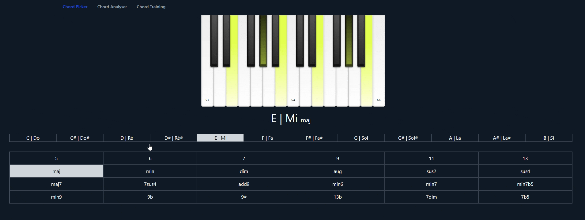
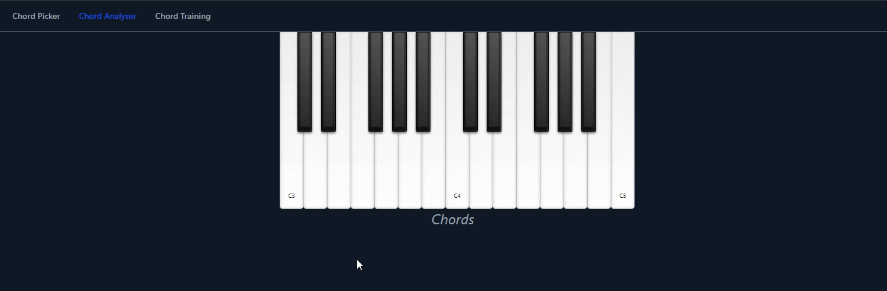
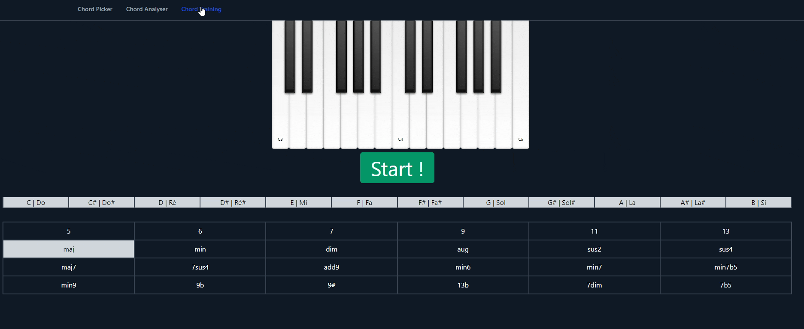

# PianoTrainer

You can plug your piano, if you have a MIDI cable.

## Chord Picker

This is a chord bank.

In this section, you can select a note and a mode. It will display the corresponding chord.

## Chord Analyser

You can play a chord on your piano. If the chord is recognize, it will display the name of the chord you are playing

## Chord Training

Select the range of note/mode you want to practice.
Once you played the correct chord, it will go to the next.

